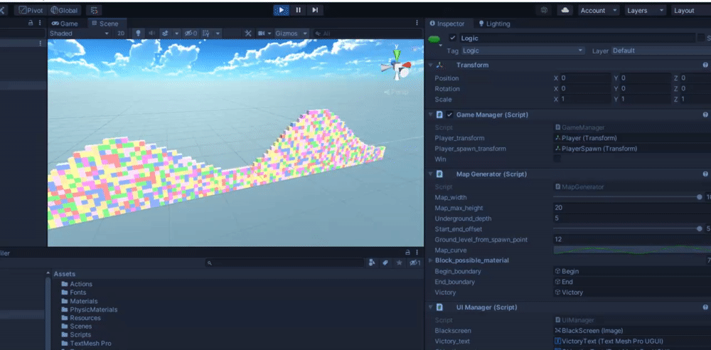

# Ball Game
Ball Game is a very simple game where you have to bring a ball to the end of the path, before a timer goes to 0.

# Controls

- W: Jump
- A, D: Move left/right

# Map generation

The script, MapGenerator, generates a different level at each simulation. 

The path's structure is built based on an animation curve, which can be viewed in the inspector; the map's structure can be also created by hand in the inspector (just remember to disable the variable m_generate_map_procedurally from the inspector).

